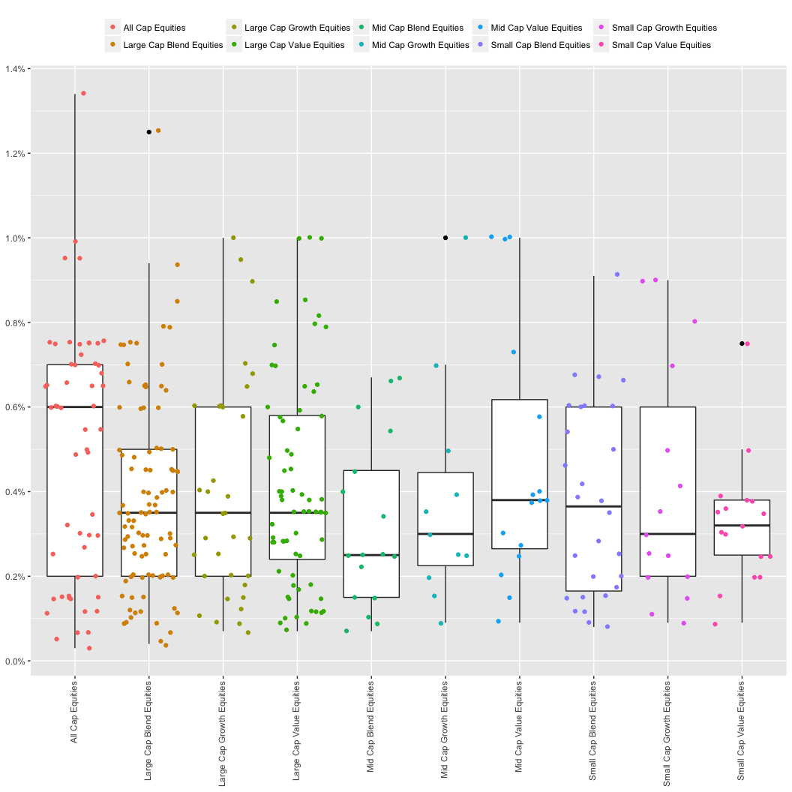

Selecting ETFs for each asset class
================

Introduction
------------

Part 1 determined which lazy portfolios were the best performers. Part 2 will determine which ETFs are the best choices for these lazy portfolios. The selection basis will be contingent on the expense ratio and their alpha.

356 stock instruments across 10 asset classes were hand scraped from ETFdb.com. The following is a jitter overlaid by a box and whisker of the expense ratios of each ETF separating according to asset class. It's definitely a busy graph, but it provides an unadulterated view of the entire data set. Let's dive deeper.

Including Code
--------------

You can include R code in the document as follows:

Including Plots
---------------

You can also embed plots, for example:

